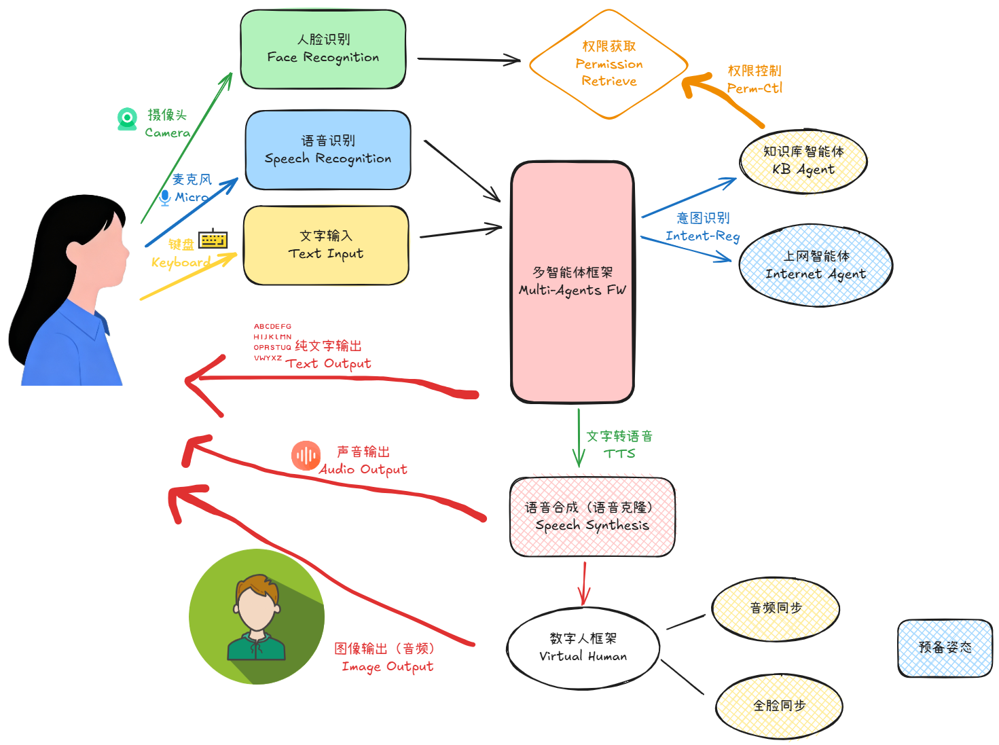

# Demo演示方案

## 项目概述
搭建一个智能体系统，整合以下技术栈打造数字分身：
- YOLO目标检测
- 面部识别
- 大语言模型
- 语音处理（ASR/TTS）

## 系统流程

### 1. 虚拟人展示
- 屏幕显示克隆的虚拟人形象
- 具备真实面貌特征
- 支持动态表情和动作
- 支持本尊的声音

### 2. 交互流程

#### 初始问候
1. **语音输入**: 用户说"你好"
2. **语音识别**: 音转文(ASR)
3. **意图识别**: 解析用户意图
4. **人脸检测**: 
   - 监测摄像头画面
   - 检测是否存在人脸
5. **人脸识别**: 识别目标人物身份
6. **响应输出**: 
   - 文字: "你好啊，某某某"
   - 语音: TTS合成输出

#### 问答交互
1. **知识检索**:
   - 查询知识库
   - 命中结果 → 进入权限验证
   - 未命中 → 联网搜索
   
2. **权限验证**:
   - 检查知识绑定的用户身份
   - 当前用户与绑定用户匹配 → 返回知识内容
   - 当前用户与绑定用户不匹配 → 回复"换个别的问题吧"
   
3. **语音合成**:
   - 文本通过预训练TTS模型
   - 转换为语音输出